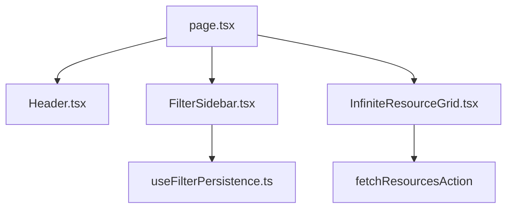

# Ralph Gate 1 & 2: Physical Audit & Assessment (TASK_009)

**Date:** February 4, 2026
**Git HEAD:** $(git rev-parse HEAD)
**Status:** ✅ COMPLETED

---

## 📋 1. Physical Audit (Gate 1)

### Current State Analysis
The directory listing at `http://localhost:3000` utilizes a two-column layout on desktop:
- **Left Column**: `FilterSidebar` (Pricing, Sort, Categories, Tags).
- **Right Column**: Resource grid with `InfiniteResourceGrid`.

### Direct Observation (Browser Audit)
- **Problem**: The `FilterSidebar` does not have an independent scrollbar. Its height often exceeds the browser viewport (especially with many categories/tags).
- **Conflict**: To see bottom filters, users must scroll the entire window. This triggers the `InfiniteResourceGrid` loader, which extends the page further, making the bottom of the sidebar a "moving target" that is difficult to reach.
- **Header Interference**: The `CategoryTabs` (horizontal bar) is sticky but adds vertical weight, reducing the available viewport for the sidebar.

### Evidence
- **Audit Tool Result**: `sidebar.scrollHeight > sidebar.clientHeight` confirmed.
- **Scroll Test**: `sidebar.scrollTop` remains `0` because `overflow-y` is not set to `auto`/`scroll`.

---

## 🗺️ 2. Logic Mapping & Research (Gate 2)

### Consumer Analysis
- **Primary Consumers**: Desktop users browsing the directory.
- **Impact**: High. Filtering is a core discovery path. Friction here leads to session abandonment.

### Dependency Map

### Research Findings
- **Standard Pattern**: FAANG-grade directories (e.g. AWS Console, Google Cloud Console) use fixed-height sidebars with internal scrolling for long filter lists.
- **Vercel/Next.js**: Sticky positioning is efficient but requires a defined height or `max-height: 100vh` to allow internal scroll.

### Alternatives Considered
1. **Reduce Filter Count**: Not viable (reduces discovery).
2. **Move Filters to Modal**: Bad for desktop UX (requires extra clicks).
3. **Fixed Sidebar + Absolute Grid**: Complex responsive handling.
4. **Sticky Sidebar with Internal Scroll (Proposed)**: Modern, efficient, and fixes the conflict with infinite scroll.

---

## 🎯 Next Steps
Proceed to **Gate 3: Blueprint & RFC** to define the specific CSS and structural changes.
